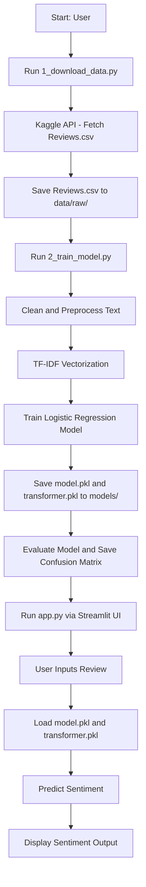

# Amazon Fine Food Reviews - Sentiment Analysis

This project builds a machine learning model to classify Amazon Fine Food reviews into three categories: **Positive**, **Negative**, or **Neutral**. The entire pipeline—from data acquisition to model deployment via a web interface—is included.

---

## 📌 Project Overview

The primary goal is to analyze the sentiment of user-submitted text reviews. The process involves:

- **Data Collection**: Downloading the review dataset from Kaggle.
- **Data Cleaning & Preprocessing**: Removing HTML tags, punctuation, stopwords, and applying stemming.
- **Model Training**: Training a Logistic Regression model on TF-IDF vectorized data.
- **Model Evaluation**: Assessing model performance using accuracy and a confusion matrix.
- **Deployment**: Serving the trained model via a simple, interactive web UI built with Streamlit.

---

## 🛠 Technology Stack

- **Language**: Python 3.x  
- **Data Manipulation**: `pandas`, `numpy`  
- **NLP & ML**: `scikit-learn`, `nltk`  
- **Web App**: `streamlit`  
- **Visualization**: `matplotlib`, `seaborn`, `wordcloud`  
- **Data Acquisition**: `kaggle` API  

---

## 📂 Directory Structure- after running
```markdown
amazon-sentiment-analysis/
│
├── data/
│ └── raw/
│ └── Reviews.csv
│
├── models/
│ ├── model.pkl
│ ├── transformer.pkl
│ └── confusion_matrix.png
│
├── src/
│ ├── init.py
│ ├── data_preparation.py
│ └── preprocessing.py
│
├── .gitignore
├── 1_download_data.py
├── 2_train_model.py
├── 3_predict_sentiment.py
├── app.py
└── requirements.txt
```
---

## 🔄 Workflow

### 💡 Simplified Usage

For a quicker start, simply run the `.ipynb` notebook provided in this repository. It walks through the entire pipeline—from data download to model training and prediction—in an interactive format.
